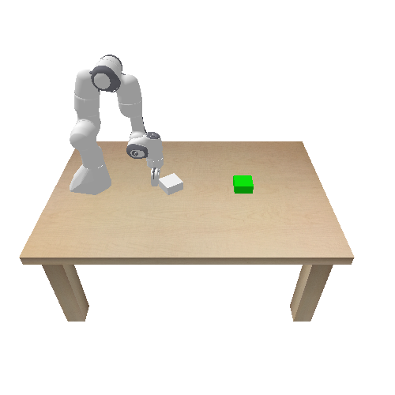
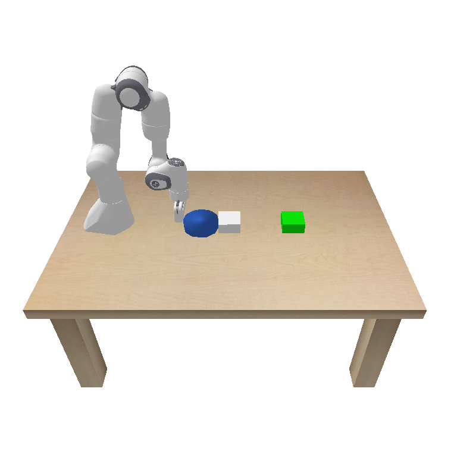
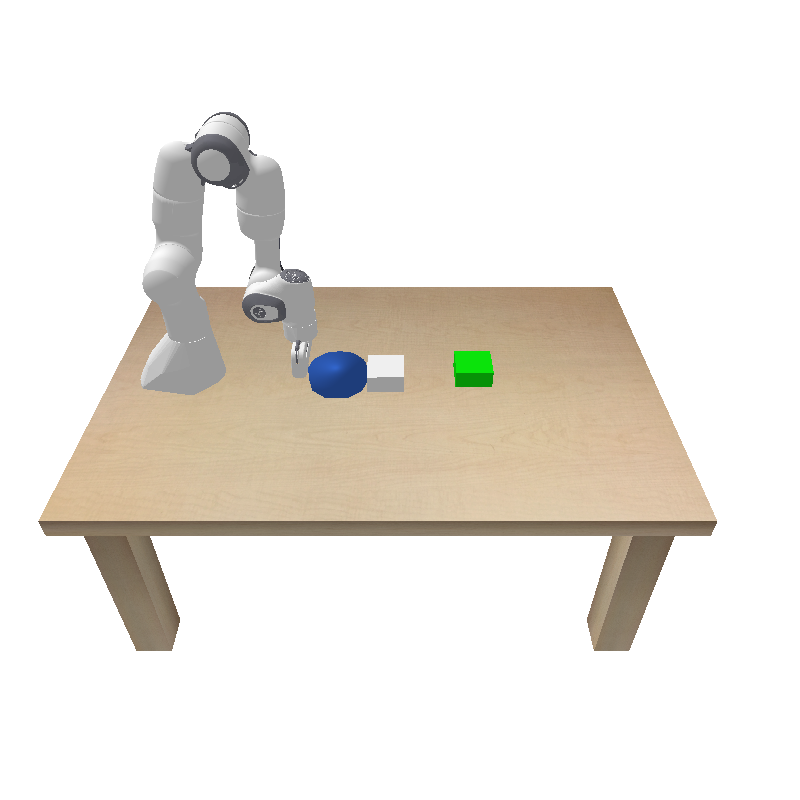

# Learning-Multi-Body-Dynamics
## Simulator-Augmented Interaction Networks (SAIN) for Proxy Pushing  
Learn and model the dynamics of an agent pushing a target object, and use it to plan a control strategy to make the target object reach the target position

> **Task**: Use a Franka Panda arm to push a **middle object**  as a proxy tool to indirectly drive a **target object**  into a green goal region.  
> **Approach**: Re-implement Ajay *et al.* ICRA 2019’s **Simulator-Augmented Interaction Network (SAIN)** combined with **MPPI** for closed-loop control in PyBullet.

---

## 📂 Repository Structure  
├── assets/ # URDF models and geometry
├── dataset/ # Collected .npz data chunks 
├── checkpoints/ # Trained model weights 
├── data_collected.py # Multi-process data collection script
├── data_processing.py # Dataloader
├── demo.py # SAIN + MPPI closed-loop demo (pybullet GUI) 
├── run_mppi.py # SAIN + MPPI closed-loop demo (produces GIF) 
├── mppi.py # Generic MPPI sampler 
├── mppi_control.py # SAIN + MPPI closed-loop demo (produces GIF) 
├── panda_pushing_env.py # Two-disk PyBullet environment 
├── sain_model.py # Interaction Network & SAIN implementations 
├── visualizers.py # get gif sample
└── README.md # ← You are here

## Environment Setup
conda create -n sain_torch python=3.10
conda activate sain_torch
pip install -r requirements.txt

## Future Work
Graph-based ODE for continuous-time prediction
Extend to 3D proxy pushing with obstacles
Deploy on real Franka Panda with vision feedback

## References
Ajay A., Bauza M., Wu J., Fazeli N., Tenenbaum J.B., Rodriguez A., Kaelbling L.P.“Combining Physical Simulators and Object-Based Networks for Control.” ICRA 2019 arXiv:1904.07301
